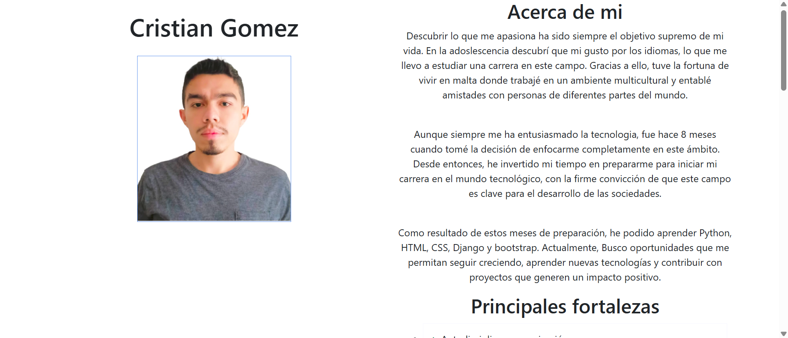
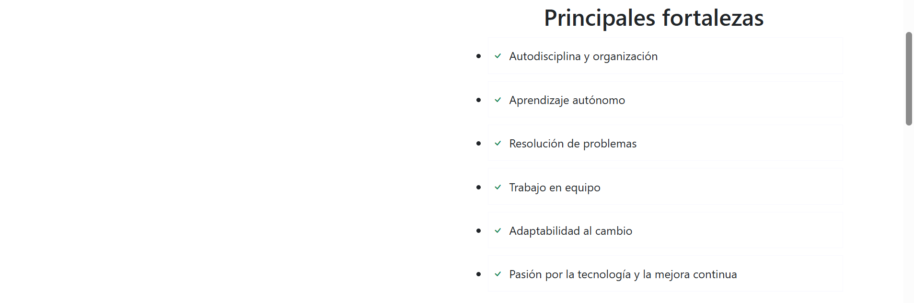
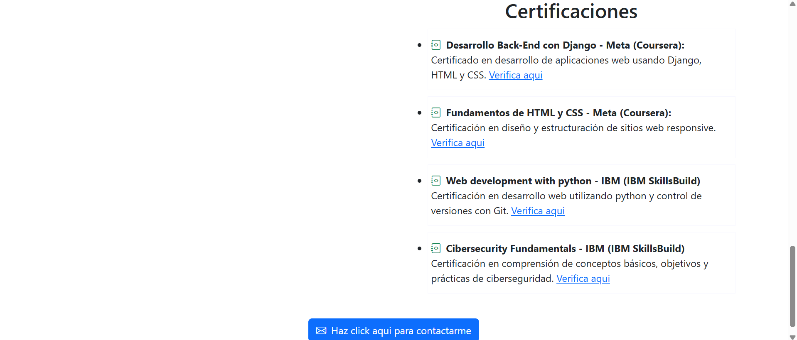
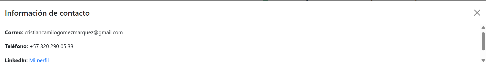

# Perfil-profesional
Proyecto web creado con HTML, CSS y Bootstrap para mostrar de manera profesional mi perfil. 

# Tecnologías utilizadas
- HTML
- CSS
- Bootstrap

# Objetivo
Mostrar de forma clara mis fortalezas, capacidades, habilidades y proyectos a posibles empleadores.  

# Capturas de pantalla
A continuación se muestran las capturas de pantallas organizadas según el perfil.

# Captura 1

# captura 2

# captura 3

# captura 4

# captura 5

# captura 6

# Cómo ver el sitio
solo tienes que abrir el archivo index.html en tu navegador

# Autor

Cristian Camilo Gómez Márquez
[LinkedIn](https://www.linkedin.com/in/cristian-camilo-gomez-marquez-1b2a20263/)

